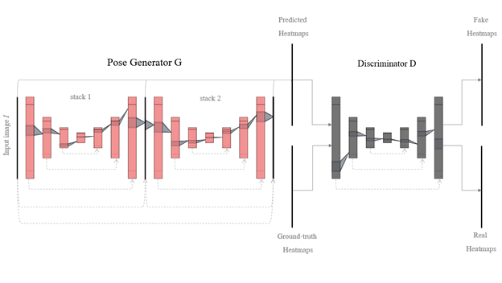
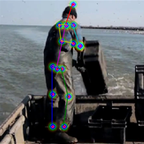
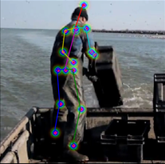
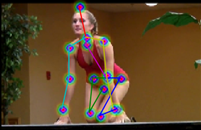
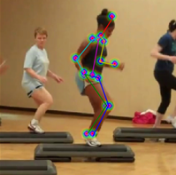

# Adversarial Learning for Human Pose Estimation

### Abstract
Pose estimation using Deep Neural Networks (DNNs) has shown superior performance in recent years, due to the availability of larger training datasets and powerful GPUs. However, the task is still challenging due to the large variability of human body appearances, lighting conditions, complex background, occlusions, body physique and posture structures of the activities performed by the subject. Among all these peculiarities, partial occlusions, and overlapping body poses often result in deviated pose predictions. These circumstances can result to wrong, and sometimes unrealistic results. Human mind can predict such poses because of the underlying structure awareness, of the geometry, of a human body in our minds. In this thesis, we discuss a training technique that can overcome these problems by instating Discriminator which helps to incorporate priors about the structure of human body by distinguishing between the real and fake (or biologically implausible) poses. 

### Model Architecture

### Results

 | 
:------------------------------------:|:------------------------------------------:
 | 
